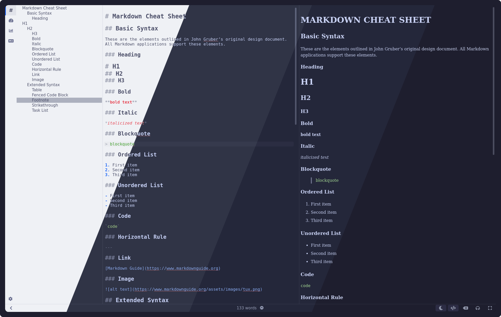
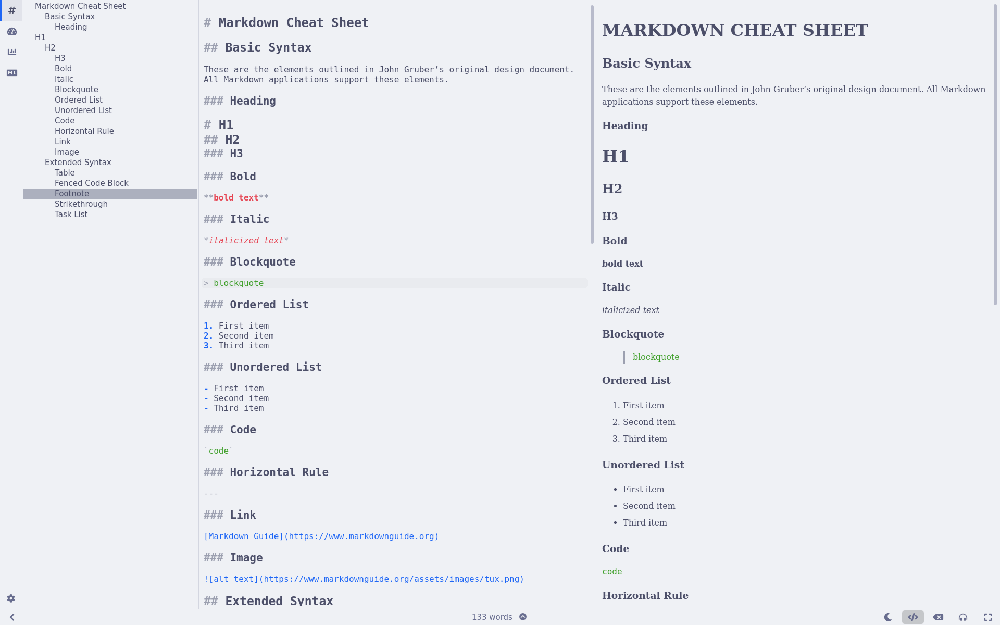
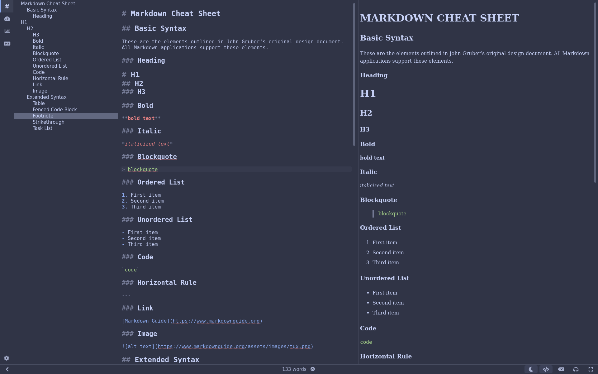
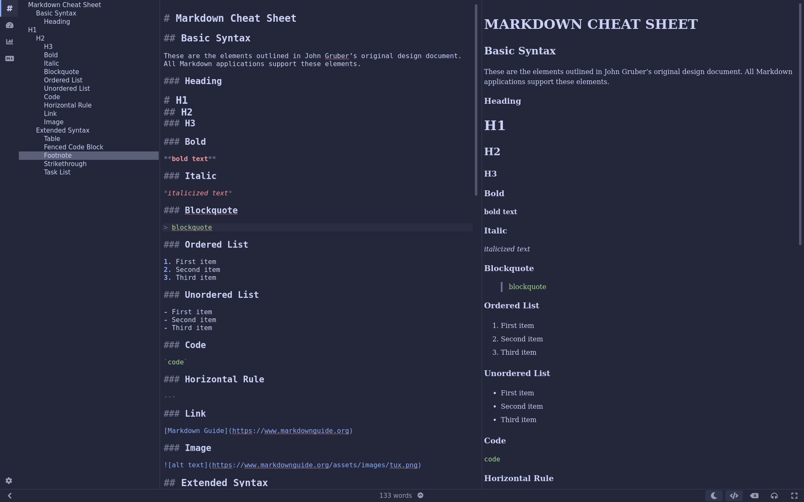
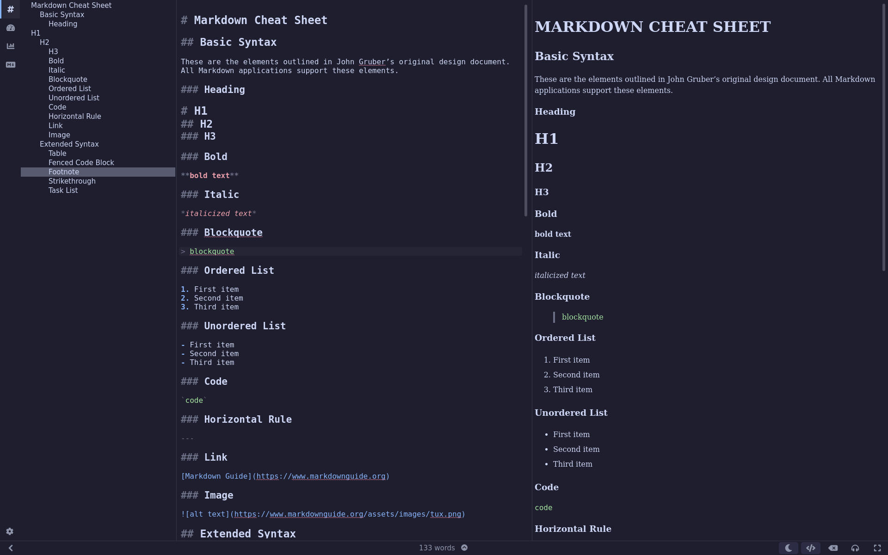

<h3 align="center">
	 
	
	Catppuccin for <a href="https://ghostwriter.kde.org/">ghostwriter</a>
	
</h3>

	
	
	

	

## Previews

🌻 Latte

🪴 Frappé

🌺 Macchiato

🌿 Mocha

## Usage

1. Navigate to [Releases](https://github.com/bagelwaffle/ghostwriter/releases/)
2. Extract the .zip file
3. Move the json files to:
- Windows: `C:\Users<your_user_name>\AppData\Roaming\ghostwriter\themes\`
- Windows (Portable): `<your_ghostwriter_portable_folder>\data\themes\`
- GNU/Linux: `~/.config/ghostwriter/themes/`
- GNU/Linux (Flatpak): `~/.var/app/io.github.wereturtle.ghostwriter/config/ghostwriter/themes/`
- macOS: `~/Library/Application Support/ghostwriter/themes/`
4. Select the theme you want in `Ghostwriter Settings/Themes`

<!-- this section is optional -->
## 🙋 FAQ

-	Q: **_"Where is Latte?"_**\
	A: Latte is included in every theme as the light mode, simply click the moon on the bottom right of your screen!

## 💝 Thanks to

- [BagelWaffle](https://github.com/bagelwaffle)

&nbsp;

	

	Copyright &copy; 2021-present <a href="https://github.com/catppuccin" target="_blank">Catppuccin Org</a>

	

